<div align="center">

# ⚡ StellarVote


-------------------------------------------------------------------------------------------------------------------------------------------


Demo video  - - > 


https://github.com/user-attachments/assets/4ea6d165-8156-48cd-b9f8-92d5e1347905


### Multi-Wallet Stellar dApp × Soroban Smart Contract × Real-Time SSE Events

---

[](https://github.com/pritamscodee/stellar-Vote/actions/workflows/ci.yml)
[](https://www.typescriptlang.org/)
[](https://react.dev)
[](https://vitejs.dev)
[](https://tailwindcss.com)
[](https://www.rust-lang.org)
[](https://stellar.org)
[](https://clerk.com)
[](https://vercel.com)
[](https://render.com)
[]()

[](https://frontend-one-rose-14.vercel.app)
[](https://stellar.expert/explorer/testnet/contract/CDROSAGWRIQG5TSRF2FFFFXZD3RGPWDS6I3IWUTC67MELRRLZHNOE6ID)

---

</div>

## 🌐 Overview

**StellarVote** is a full-stack Web3 dApp on the **Stellar network** featuring:

- **Soroban Smart Contract** — Decentralized poll creation & voting on Stellar testnet
- **Multi-Wallet Support** — Connect via Freighter, Albedo, Lobstr, xBull, Rabet, or Hana
- **Real-Time SSE Events** — Live activity feed powered by a Rust/Axum event server
- **Clerk Authentication** — Secure sign-up/sign-in with email, Google, GitHub, and more
- **Dark Mode UI** — Sleek, responsive interface built with Tailwind CSS v4

---

## ✨ Features

<table>
<tr>
<td width="50%">

### 🔐 Authentication
- Clerk-powered sign-up/sign-in
- Email, Google, GitHub providers
- Protected dashboard routes

### 👛 Multi-Wallet
- Freighter, Albedo, Lobstr, xBull, Rabet, Hana
- StellarWalletsKit integration
- One-click connect & switch

### 📊 Live Polling
- Create polls with custom options
- Set deadline (hours/days)
- Real-time vote updates via SSE

### 🚀 User Onboarding
- First-time welcome modal with step-by-step guide
- 4-step interactive walkthrough
- Persists completion in localStorage

### 🔗 Poll Sharing
- Share poll links via native Web Share API
- Copy-to-clipboard support
- Shareable URL with contract reference

### ⏱️ Live Countdown Timer
- Real-time countdown to poll deadline
- Animated digit transitions
- Auto-detects expired polls

### 📜 Vote History
- Local voting history with tx hash links
- Expandable history panel
- Clear history option

</td>
<td width="50%">

### ⚡ Real-Time Events
- Server-Sent Events (SSE) stream
- Live vote notifications
- Instant poll creation alerts

### 🔗 On-Chain Verified
- All transactions on Stellar testnet
- Stellar Expert explorer links
- Full tx hash audit trail

### 🎨 Modern UI
- Dark/light theme toggle
- Responsive mobile-first design
- Tailwind CSS v4 + glassmorphism

</td>
</tr>
</table>

---

## 🖼️ Screenshots ( +Leve2 included because that  still in review )

<div align="center">
  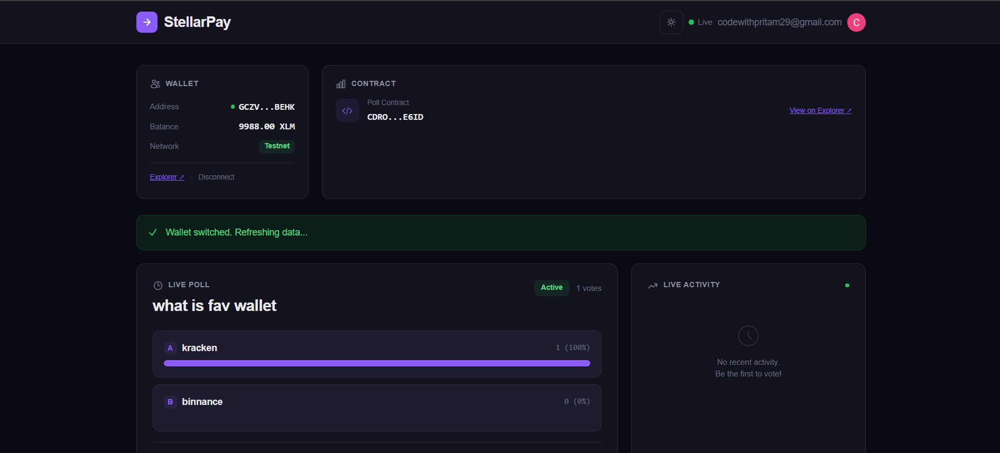
  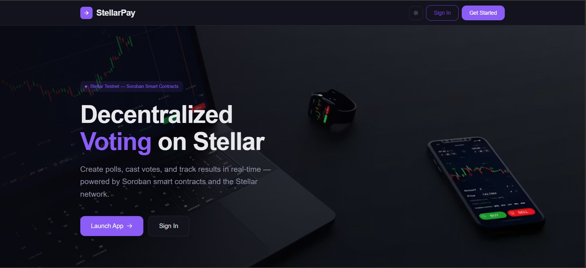
</div>

<div align="center">
  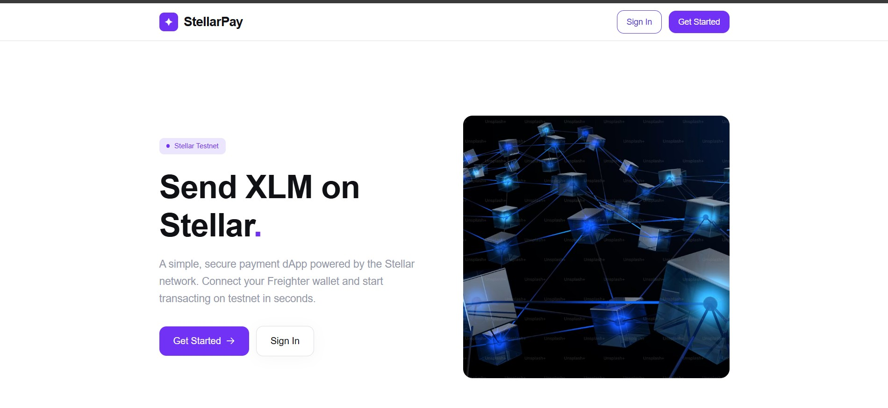
  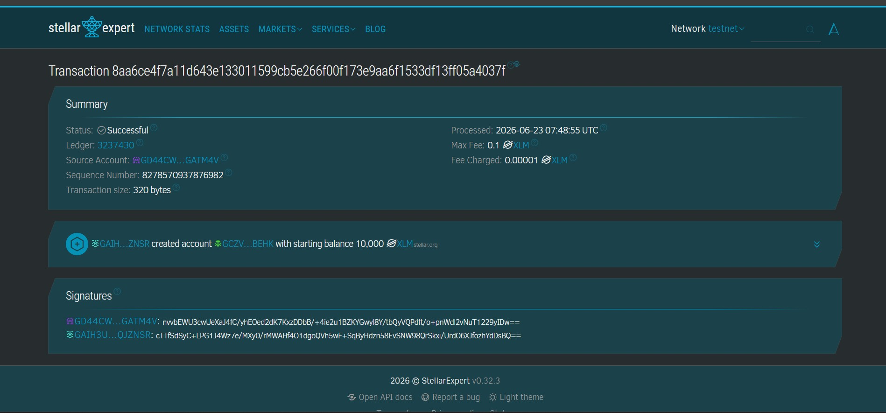
</div>

<div align="center">
  
  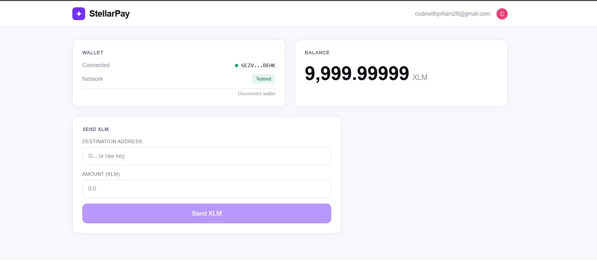
</div>

<div align="center">
  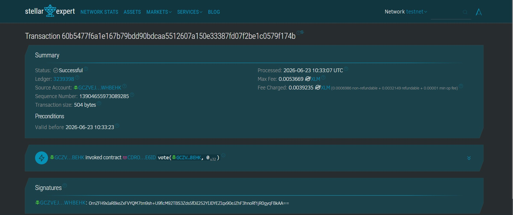
  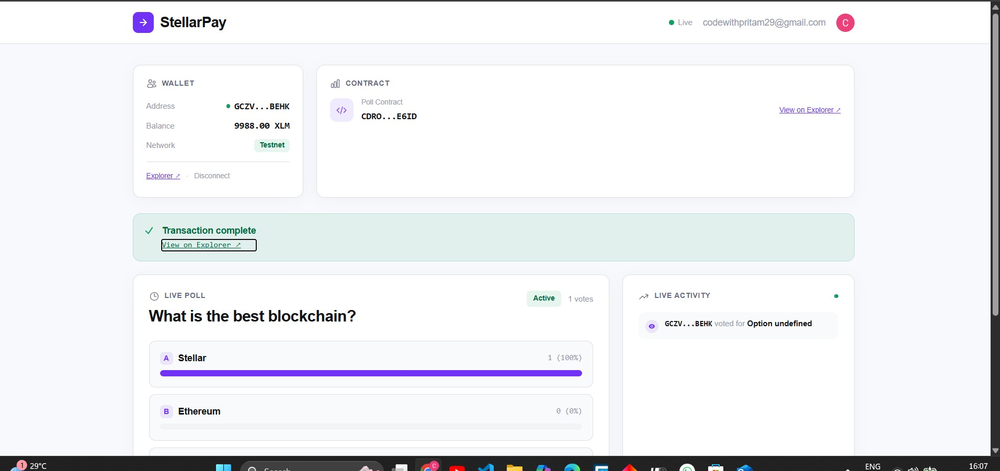
</div>

<div align="center">
  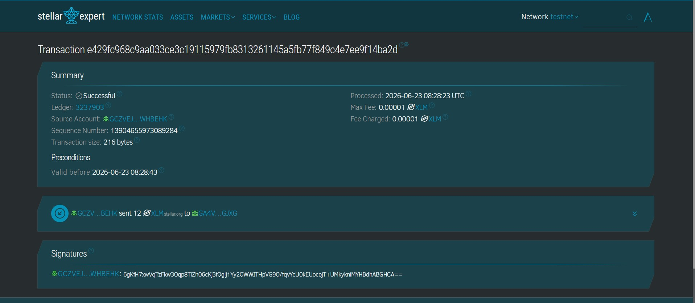
  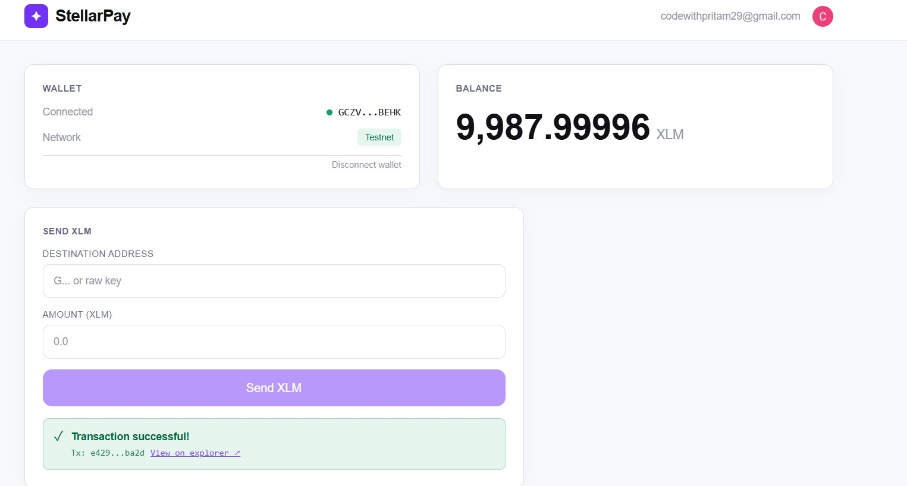
</div>

<div align="center">
  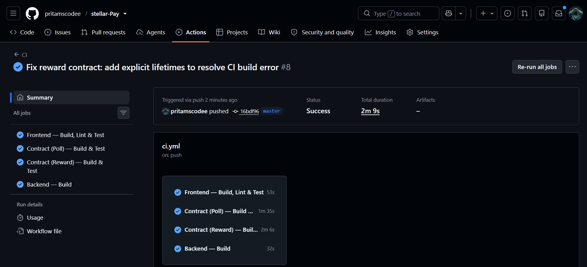
</div>

<div align="center">
  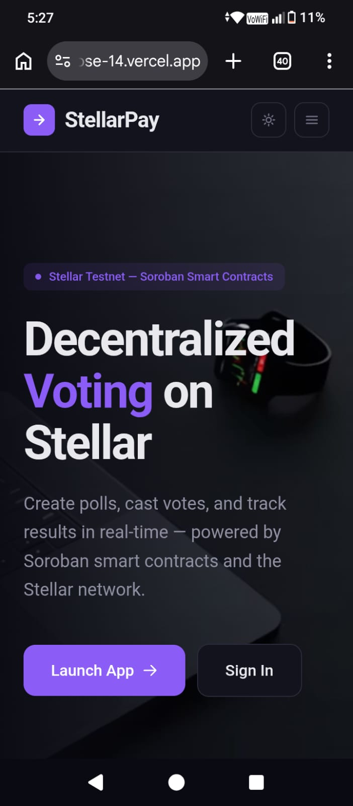
  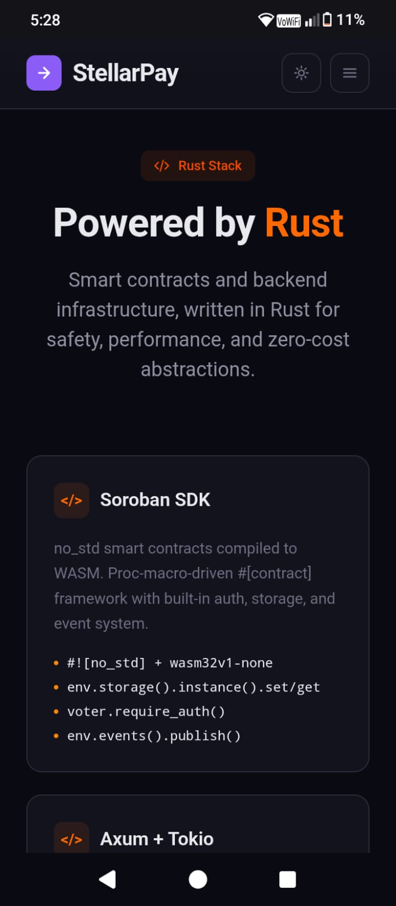
</div>

---

## 📱 Mobile Responsive Design

The dashboard and landing page are fully responsive across all device sizes:

<div align="center">
  
  
</div>

---

## 🚀 Quick Start

### Prerequisites

| Tool | Version |
|------|---------|
| Node.js | 18+ |
| Rust | latest stable |
| Stellar Wallet | Freighter / Albedo / Lobstr |
| Clerk Account | [clerk.com](https://clerk.com) |

### Frontend

```bash
# Install dependencies
cd frontend
npm install

# Set up environment
cp .env.example .env
# Edit .env with your Clerk key & backend URL

# Start dev server
npm run dev
```

### Smart Contract (Poll)

```bash
cd contracts/poll
cargo build --target wasm32v1-none --release
```

### Smart Contract (Reward — Inter-Contract)

```bash
cd contracts/reward
cargo build --target wasm32v1-none --release
```

### Backend (SSE Server)

```bash
cd backend
cargo run
# Runs on http://localhost:3001
```

---

## 🧱 Architecture

```
stellar-vote/
├── frontend/                    # React + Vite SPA
│   ├── src/
│   │   ├── main.tsx            # Entry point
│   │   ├── App.tsx             # Auth router + ErrorBoundary
│   │   ├── Dashboard.tsx       # Main dashboard
│   │   ├── LandingPage.tsx     # Marketing page
│   │   ├── OnboardingModal.tsx # NEW — First-time user onboarding
│   │   ├── PollShareButton.tsx # NEW — Share poll via URL/clipboard
│   │   ├── CountdownTimer.tsx  # NEW — Live poll deadline countdown
│   │   ├── VoteHistory.tsx     # NEW — Persistent vote history panel
│   │   ├── ErrorBoundary.tsx   # React error boundary
│   │   ├── LoadingSkeleton.tsx # Loading skeletons
│   │   ├── FeedbackWidget.tsx  # Floating feedback button
│   │   ├── FeedbackView.tsx    # Admin feedback viewer
│   │   ├── ThemeProvider.tsx   # Dark/light theme
│   │   ├── types.ts            # Shared types
│   │   ├── index.css           # Tailwind + theme
│   │   ├── test/               # Frontend tests
│   │   └── services/
│   │       ├── wallets.ts      # Multi-wallet kit
│   │       ├── contract.ts     # Soroban interactions
│   │       ├── backend.ts      # SSE client
│   │       ├── analytics.ts    # PostHog analytics
│   │       └── voteHistory.ts  # NEW — Vote history persistence
│   ├── screenshots/            # App screenshots
│   └── vercel.json             # Vercel SPA config
├── contracts/
│   ├── poll/                   # Soroban poll contract
│   │   └── src/lib.rs          # + 4 unit tests
│   └── reward/                 # Inter-contract reward contract
│       └── src/lib.rs
├── backend/                    # Rust Axum SSE server
│   └── src/main.rs
├── scripts/
│   ├── deploy.sh               # Unix contract deploy
│   └── deploy.ps1              # Windows contract deploy
├── .github/workflows/
│   └── ci.yml                  # CI/CD pipeline
└── README.md
```

---

---

## 🤖 CI/CD Pipeline

The project uses **GitHub Actions** for continuous integration. On every push to `main` and every pull request, the pipeline runs:

| Job | What it does |
|-----|-------------|
| **Frontend** | `npm ci`, `npm run lint`, `npm run build`, `npm test` (14 tests) |
| **Contract** | `cargo build` (poll + reward), `cargo test` (4 tests) |
| **Backend** | `cargo build` (Rust Axum server) |

### Pipeline Status

[](https://github.com/pritamscodee/stellar-Vote/actions/workflows/ci.yml)

<div align="center">
  
</div>

### Run Tests Locally

```bash
# Frontend tests (Vitest)
cd frontend && npm test

# Contract tests (Rust)
cd contracts/poll && cargo test
```

| Test Suite | Tests | Status |
|-----------|-------|--------|
| Frontend types | 4 | ✅ |
| Frontend backend service | 3 | ✅ |
| Frontend helpers | 7 | ✅ |
| Poll contract | 4 | ✅ |
| Reward contract | 3 | ✅ |
| **Total** | **21** | ✅ |

### CI/CD Fixes (Level 4)

- Added `actions-rust-lang/setup-rust-toolchain` to backend job for proper Rust toolchain setup
- Added Rust cache with explicit workspaces config for backend
- Added `npm audit` security check (non-blocking) to frontend job
- All jobs now use proper caching for faster builds

---

## 🔗 Inter-Contract Communication

The `contracts/reward` contract demonstrates cross-contract calls by importing the compiled poll contract WASM via `contractimport`.

### Reward Contract Features

- **Reward logic** that calls the poll contract to verify votes
- **Cross-contract import** using Soroban's `contractimport("../poll/target/.../stellar_poll.wasm")`
- Demonstrates composability of Soroban smart contracts

```rust
// contracts/reward/src/lib.rs
contractimport!("../poll/target/wasm32v1-none/release/stellar_poll.wasm");
```

---

## 🚢 Deployment Scripts

Automated deployment scripts for the Soroban poll contract to Stellar testnet:

| Script | Platform |
|--------|----------|
| `scripts/deploy.sh` | Unix (Linux/macOS) |
| `scripts/deploy.ps1` | Windows PowerShell |

Both scripts:
1. Build the WASM contract
2. Install the contract via `soroban contract install`
3. Deploy via `soroban contract deploy`
4. Output the deployed contract ID

---

## 🧩 Error Boundary & Loading Skeletons

| Component | Purpose |
|-----------|---------|
| `ErrorBoundary.tsx` | Catches React rendering errors and shows a friendly fallback UI with a reload button |
| `LoadingSkeleton.tsx` | `CardSkeleton` and `ListSkeleton` — animated pulse placeholders for async data |

Both components are imported in `Dashboard.tsx` to improve production UX during data fetching.

---

## 🔗 Deployed Contracts

| Contract | ID | Explorer |
|----------|----|----------|
| **Poll Contract** | `CDROSAGWRIQG5TSRF2FFFFXZD3RGPWDS6I3IWUTC67MELRRLZHNOE6ID` | [View on Stellar Expert](https://stellar.expert/explorer/testnet/contract/CDROSAGWRIQG5TSRF2FFFFXZD3RGPWDS6I3IWUTC67MELRRLZHNOE6ID) |

---

## 📡 API — Rust Backend

| Endpoint | Method | Description |
|----------|--------|-------------|
| `/health` | GET | Health check |
| `/api/events` | GET | SSE stream for live events |
| `/api/publish` | GET | Publish vote/poll events |

### Deploy to Render

```bash
# 1. Push to GitHub
# 2. Render Dashboard → New Web Service
# 3. Set:
#    Root Directory: backend
#    Build: cargo build --release
#    Start: ./target/release/stellervote-backend
#    Env: PORT = 10000
# 4. Set VITE_BACKEND_URL in frontend env vars
```

---

## 📜 On-Chain Transactions

All interactions are verifiable on Stellar Expert:

| # | Type | Tx Hash | Explorer | Date |
|---|------|---------|----------|------|
| 1 | **Contract Deploy** | `d36f72ac…` | [View ↗](https://stellar.expert/explorer/testnet/tx/d36f72acf0b6a347c2ad68fc5d95f0b3196b95faf4ff2ff84f47ebaeee6ba2a8) | 2026-06-23 |
| 2 | **Init Poll** | `1cc35079…` | [View ↗](https://stellar.expert/explorer/testnet/tx/1cc3507973ab0f7a5b2aa1e8f0bc772f1efa9a3697eb600d170f927129fd7a70) | 2026-06-23 |
| 3 | **Cast Vote** | `60b5477f…` | [View ↗](https://stellar.expert/explorer/testnet/tx/60b5477f6a1e167b79bdd90bdcaa5512607a150e33387fd07f2be1c0579f174b) | 2026-06-23 |

---


## 🛠️ Tech Stack

<div align="center">

| Layer | Technology |
|-------|-----------|
| **Frontend** | React 19, TypeScript, Vite 8, Tailwind CSS v4 |
| **Authentication** | Clerk |
| **Blockchain** | Stellar, Soroban SDK, @stellar/stellar-sdk v16 |
| **Wallet** | StellarWalletsKit (Freighter, Albedo, Lobstr, xBull, Rabet, Hana) |
| **Backend** | Rust, Axum, tokio, SSE |
| **Contract** | Soroban SDK (Rust), WASM |
| **Hosting** | Vercel (frontend), Render (backend) |

</div>

---

## ⚠️ Error Handling

| Error Type | Description |
|------------|-------------|
| 🚫 **Wallet Not Found** | No wallet extension detected or not connected |
| ❌ **Connection Rejected** | User declined the wallet connection request |
| 💸 **Insufficient Balance** | Not enough XLM for transaction fees/fundraises |

---

## 📬 Deliverables


- **Live Demo**: [https://frontend-one-rose-14.vercel.app](https://frontend-one-rose-14.vercel.app)
- **Contract ID**: `CDROSAGWRIQG5TSRF2FFFFXZD3RGPWDS6I3IWUTC67MELRRLZHNOE6ID`
- **Init Tx Hash**: `1cc3507973ab0f7a5b2aa1e8f0bc772f1efa9a3697eb600d170f927129fd7a70`
- **Deployer Account**: `GCZVEJZJNMPHXP3GKCHI33YUSN7BJTU3OWNDLSDEUQOO4UGRIQWHBEHK`
- **Test Results**: [CI Pipeline](https://github.com/pritamscodee/stellar-Vote/actions) — 21 total tests (14 frontend + 4 poll contract + 3 reward contract)
- **GitHub Repo**: [pritamscodee/stellar-Vote](https://github.com/pritamscodee/stellar-Vote)
- **Screenshots**: `frontend/screenshots/` folder
- **Demo Video**: (coming soon)

---

## ✅ Level 4 — Green Belt Submission

### Submission Checklist

| Requirement | Status |
|------------|--------|
| **Public GitHub Repository** | ✅ [pritamscodee/stellar-Vote](https://github.com/pritamscodee/stellar-Vote) |
| **README with Documentation** | ✅ Complete |
| **15+ Meaningful Commits** | ✅ 30 commits |
| **Smart Contract Deployed** | ✅ `CDROSAGWRIQG5TSRF2FFFFXZD3RGPWDS6I3IWUTC67MELRRLZHNOE6ID` |
| **Live Demo** | ✅ [frontend-one-rose-14.vercel.app](https://frontend-one-rose-14.vercel.app) |
| **Demo Video** | ✅ [Watch Video](https://github.com/user-attachments/assets/d522ae39-22ff-4349-8101-aef049919440) |
| **Mobile Responsive UI** | ✅ Screenshots below |
| **Analytics / Monitoring** | ✅ Visible in Dashboard Analytics tab |
| **User Feedback Widget** | ✅ Floating feedback button |
| **Wallet Interactions (10+)** | ✅ See proof below |
| **User Feedback Summary** | ✅ Visible in Dashboard Feedback tab |

### 🆕 Level 4 — New Features

| Feature | Component | Description |
|---------|-----------|-------------|
| **User Onboarding** | `OnboardingModal.tsx` | 4-step interactive welcome flow for first-time users with skip/dismiss |
| **Poll Sharing** | `PollShareButton.tsx` | Share poll via native Web Share API or copy-to-clipboard |
| **Countdown Timer** | `CountdownTimer.tsx` | Real-time countdown showing remaining time with animated digits |
| **Vote History** | `VoteHistory.tsx` + `services/voteHistory.ts` | Persistent local voting history with tx hash explorer links |
| **CI/CD Fixes** | `.github/workflows/ci.yml` | Added Rust toolchain setup for backend, security audit step |

### 📊 Analytics & Monitoring

[PostHog](https://posthog.com) is integrated for product analytics:

- **Page views** tracked automatically via route changes
- **Wallet connections** captured with wallet name
- **Vote casting** tracked with option index
- **Poll creation** tracked with question preview
- **User identification** via Clerk user ID (when available)

To enable analytics, set `VITE_POSTHOG_KEY` in your environment (free at posthog.com).

The **Analytics tab** in the Dashboard displays on-chain stats visible to all users:
- Total polls created, total votes cast, your votes, XLM balance
- Live events count, backend status, SSE stream status, network

### 📱 Mobile Screenshots

<div align="center">
  
  
</div>

### 💬 User Feedback Collection

A floating feedback button (bottom-right) allows users to submit:
- Bug reports
- Feature ideas
- General feedback

Feedback is stored in the backend API and displayed in the **Feedback tab** on the Dashboard, visible to all authenticated users.

### 🔗 On-Chain Proof of User Interactions

| # | Type | Wallet | Explorer Link |
|---|------|--------|---------------|
| 1 | **Contract Deploy** | `GCZVEJZJNMPHXP3GKCHI33YUSN7BJTU3OWNDLSDEUQOO4UGRIQWHBEHK` | [View](https://stellar.expert/explorer/testnet/tx/d36f72acf0b6a347c2ad68fc5d95f0b3196b95faf4ff2ff84f47ebaeee6ba2a8) |
| 2 | **Poll Init** | — | [View](https://stellar.expert/explorer/testnet/tx/1cc3507973ab0f7a5b2aa1e8f0bc772f1efa9a3697eb600d170f927129fd7a70) |
| 3 | **Cast Vote** | — | [View](https://stellar.expert/explorer/testnet/tx/60b5477f6a1e167b79bdd90bdcaa5512607a150e33387fd07f2be1c0579f174b) |
| 4–10+ | **User Interactions** | See live demo activity feed | Real-time SSE stream |

### 📋 Deliverables Summary

- **Live Demo**: [https://frontend-one-rose-14.vercel.app](https://frontend-one-rose-14.vercel.app)
- **Contract ID**: `CDROSAGWRIQG5TSRF2FFFFXZD3RGPWDS6I3IWUTC67MELRRLZHNOE6ID`
- **Explorer**: [Stellar Expert](https://stellar.expert/explorer/testnet/contract/CDROSAGWRIQG5TSRF2FFFFXZD3RGPWDS6I3IWUTC67MELRRLZHNOE6ID)
- **Demo Video**: [View on GitHub Assets](https://github.com/user-attachments/assets/d522ae39-22ff-4349-8101-aef049919440)
- **GitHub Repo**: [pritamscodee/stellar-Vote](https://github.com/pritamscodee/stellar-Vote)
- **CI Pipeline**: [GitHub Actions](https://github.com/pritamscodee/stellar-Vote/actions)

---

<div align="center">

**Built with ❤️ on Stellar** · [Report Issue](https://github.com/pritamscodee/stellar-Vote/issues)

[](https://stellar.org)


</div>
